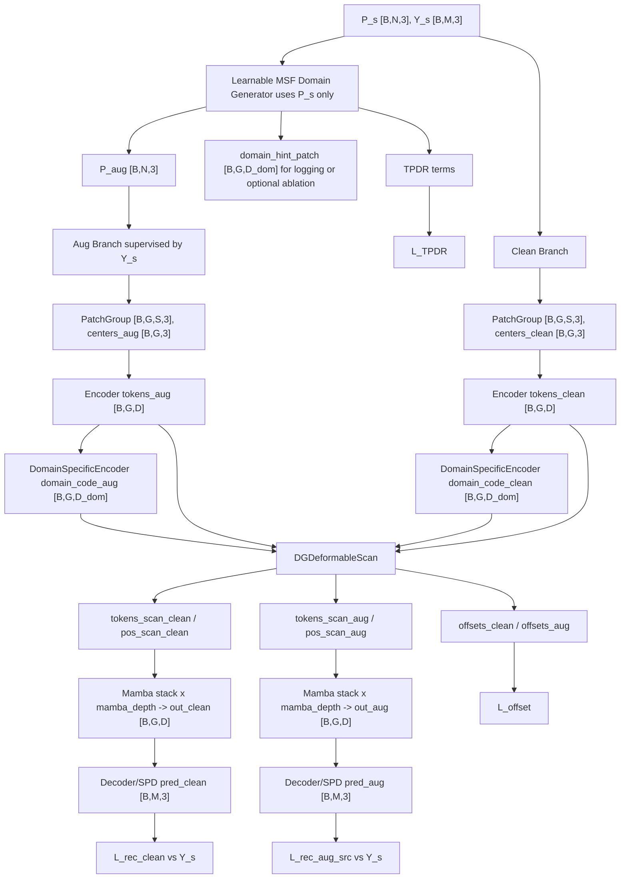

# DGPointMamba Detailed Design

## 1. Architecture Overview

DGPointMamba uses a source-only two-view training strategy:

- Clean source partial view.
- Learnably deformed pseudo-domain source partial view.

The two views share one completion backbone. The backbone keeps the useful point completion pipeline from DAPointMamba but removes active UDA source-target modules. The main method follows **Scheme A**: only the source partial input is deformed, while both clean and augmented branches are supervised by the original source complete point cloud.

Removed active modules:

- Cross-Domain Patch-Level Scanning.
- Cross-Domain Spatial SSM Alignment.
- Cross-Domain Channel SSM Alignment.
- Adaptive image-normalization-inspired token adapters.
- Cross-branch feature consistency losses not grounded in geometry.

Kept backbone components:

- `PatchGroup` single-domain serialization.
- `Encoder`.
- Mamba blocks.
- `LayerNorm`.
- Global max pooling.
- `Decoder` with `SeedGenerator` and `SPD`.

Added or revised modules:

- `LearnableSinPoint` for the Stage-1 global-parameter baseline.
- `LearnableMSFDomainGenerator`.
- `DomainSpecificEncoder`.
- `DGDeformableScan`.
- `Topology-Preserving Deformation Regularization (TPDR)`.

Important implementation cleanup:

- Remove the currently unused `self.blocks` from `DGPointMamba`.
- Replace the old two-depth configuration with one active field: `mamba_depth`.
- Make `order_mode` configuration actually control `PatchGroup` serialization.

## 2. Default Shape Constants

```text
B     = batch size
N     = 2048 partial points
M     = 2048 complete points
G     = 64 patches
S     = 32 points per patch
D     = 384 token dimension
D_dom = 64 domain-specific code dimension
k     = 4 MSF anchors
L     = mamba_depth
```

The model must keep these interfaces stable:

```text
point cloud input:        [B, N, 3]
patch neighborhoods:      [B, G, S, 3]
patch centers:            [B, G, 3]
patch tokens:             [B, G, D]
domain-specific code:     [B, G, D_dom]
position embedding:       [B, G, D]
decoder feature:          [B, D, 1]
final prediction:         [B, M, 3]
```

Canonical variable names:

| Name | Shape | Produced by | Meaning |
|---|---:|---|---|
| `P_s` | `[B,N,3]` | source dataloader | CRN source partial point cloud |
| `Y_s` | `[B,M,3]` | source dataloader | CRN source complete point cloud |
| `P_aug` | `[B,N,3]` | `LearnableSinPoint` or `LearnableMSFDomainGenerator` | Scheme-A augmented source partial input |
| `neighborhoods_clean` | `[B,G,S,3]` | `PatchGroup` | clean branch patch points |
| `neighborhoods_aug` | `[B,G,S,3]` | `PatchGroup` | augmented branch patch points |
| `centers_clean` | `[B,G,3]` | `PatchGroup` | clean branch patch centers |
| `centers_aug` | `[B,G,3]` | `PatchGroup` | augmented branch patch centers |
| `tokens_clean` | `[B,G,D]` | `Encoder` | clean branch patch tokens |
| `tokens_aug` | `[B,G,D]` | `Encoder` | augmented branch patch tokens |
| `domain_hint_patch` | `[B,G,D_dom]` | `LearnableMSFDomainGenerator` | patch-level deformation descriptor for logging or optional ablations |
| `domain_hint_global` | `[B,D_dom]` | `LearnableMSFDomainGenerator` | global deformation descriptor for logging or optional ablations |
| `domain_code_clean` | `[B,G,D_dom]` | `DomainSpecificEncoder` | clean branch domain-specific geometric code |
| `domain_code_aug` | `[B,G,D_dom]` | `DomainSpecificEncoder` | augmented branch domain-specific geometric code |
| `tokens_scan_clean` | `[B,G,D]` | `DGDeformableScan` | clean branch scan-aware tokens sent to Mamba |
| `tokens_scan_aug` | `[B,G,D]` | `DGDeformableScan` | augmented branch scan-aware tokens sent to Mamba |
| `pos_scan_clean` | `[B,G,D]` | `DGDeformableScan` | clean branch scan-aware position embeddings |
| `pos_scan_aug` | `[B,G,D]` | `DGDeformableScan` | augmented branch scan-aware position embeddings |
| `offsets_clean` | `[B,G,4]` | `DGDeformableScan` | clean branch `delta_p` and `delta_t` |
| `offsets_aug` | `[B,G,4]` | `DGDeformableScan` | augmented branch `delta_p` and `delta_t` |
| `pred_clean` | `[B,M,3]` | Decoder/SPD | clean branch completed point cloud |
| `pred_aug` | `[B,M,3]` | Decoder/SPD | augmented branch completed point cloud |

## 3. Training Data Flow

### 3.1 Input

Source batch:

```text
P_s: [B, N, 3]  source partial
Y_s: [B, M, 3]  source complete
```

No target-domain training batch is loaded.

### 3.2 Clean Branch Backbone Flow

The clean branch is part of the Stage-1 Fixed SinPoint baseline. It is not planned as a separate no-augmentation comparison experiment in the first implementation.

```text
P_s
  -> PatchGroup
      neighborhoods_clean: [B, G, S, 3]
      centers_clean:       [B, G, 3]
  -> Encoder
      tokens_clean:        [B, G, D]
  -> Plain Mamba stack x mamba_depth
      out_clean:           [B, G, D]
  -> LayerNorm
      out_clean:           [B, G, D]
  -> MaxPool over G
      global_clean:        [B, 1, D]
  -> Transpose
      global_clean:        [B, D, 1]
  -> Decoder/SPD
      pred_clean:          [B, M, 3]
```

Loss:

```text
L_rec_clean = CompletionLoss(pred_clean, Y_s)
```

### 3.3 Stage-1 Fixed or Learnable SinPoint Baseline

```text
P_s
  -> Fixed SinPoint or LearnableSinPoint
      P_aug: [B, N, 3]
```

Then the same shared completion backbone is applied to `P_aug`:

```text
P_aug -> backbone -> pred_aug
```

Loss:

```text
L_rec_aug_src = CompletionLoss(pred_aug, Y_s)
```

Stage-1 total loss:

```text
L_total = L_rec_clean + lambda_aug * L_rec_aug_src
```

The learnable global SinPoint baseline uses shared learnable parameters:

```text
A: [1, 1, 3] or [3]
w: [1, 1, 3] or [3]
```

The first version accepts the risk that `A` may shrink toward zero. The training loop must log `A`, `w`, `mean_abs_A`, `mean_abs_w`, and `mean_abs_Aw`.

### 3.4 Stage-2 Learnable MSF Branch

```text
P_s
  -> LearnableMSFDomainGenerator
      P_aug:             [B, N, 3]
      domain_hint_patch: [B, G, D_dom]
      domain_hint_global:[B, D_dom]
      tpdr_terms:        scalar dict
```

Then:

```text
P_aug -> backbone -> pred_aug
```

Loss:

```text
L_rec_aug_src = CompletionLoss(pred_aug, Y_s)
```

`Y_s` is the original CRN complete point cloud paired with `P_s`. The main method does not create or use a deformed complete supervision target.

### 3.5 Stage-3 DGDeformableScan Branches

When `DGDeformableScan` is enabled, both clean and augmented branches are encoded before entering the standalone scan module:

```text
P_s
  -> PatchGroup -> Encoder
      tokens_clean: [B, G, D]
      centers_clean:[B, G, 3]

P_aug
  -> PatchGroup -> Encoder
      tokens_aug:   [B, G, D]
      centers_aug:  [B, G, 3]
```

Domain-specific geometric codes are estimated from branch tokens and centers:

```text
tokens_clean, centers_clean -> DomainSpecificEncoder -> domain_code_clean [B, G, D_dom]
tokens_aug,   centers_aug   -> DomainSpecificEncoder -> domain_code_aug   [B, G, D_dom]
```

The two branches are then processed by the shared standalone scan module:

```text
DGDeformableScan
  input:  tokens_clean, centers_clean, domain_code_clean
  output: tokens_scan_clean, pos_scan_clean, offsets_clean

DGDeformableScan
  input:  tokens_aug, centers_aug, domain_code_aug
  output: tokens_scan_aug, pos_scan_aug, offsets_aug
```

Clean / augmented branch token interchange is allowed during training. The default implementation should exchange only selected low-criticality, high-domain-variation tokens and should use stop-gradient on donor tokens in the first stable version.

The scan-aware tokens and position embeddings are then passed to the plain shared Mamba stack:

```text
tokens_scan_clean, pos_scan_clean -> Mamba stack x mamba_depth -> out_clean
tokens_scan_aug,   pos_scan_aug   -> Mamba stack x mamba_depth -> out_aug
```

## 4. Inference Data Flow

Input target partial:

```text
P_t: [B, N, 3]
```

Flow:

```text
P_t
  -> PatchGroup
      neighborhoods_t: [B, G, S, 3]
      centers_t:       [B, G, 3]
  -> Encoder
      tokens_t:        [B, G, D]
  -> optional DomainSpecificEncoder
      domain_code_t:   [B, G, D_dom]
  -> optional DGDeformableScan
  -> Mamba stack x mamba_depth
      out_t:           [B, G, D]
  -> LayerNorm + MaxPool + Decoder/SPD
      pred:            [B, M, 3]
```

The inference API should support:

```python
pred, aux = model(partial)
```

where `aux` may contain offsets, domain-specific codes, and generator statistics when available.

## 5. Module Details

### 5.1 LearnableSinPoint

Purpose:

- Provide the minimal learnable pseudo-domain baseline.
- Turn the current fixed SinPoint amplitude and frequency into trainable global parameters.
- Keep the current SinPoint input-output contract.

Input:

```text
partial: [B, N, 3]
```

Output:

```text
partial_aug: [B, N, 3]
stats:       dict
```

Default parameterization:

```text
A_raw: [3]
w_raw: [3]
A = A_max * tanh(A_raw)
w = w_max * tanh(w_raw)
```

Recommended default bounds:

```text
A_max = 0.8
w_max = 3.0
```

The module must preserve point count and device.

### 5.2 LearnableMSFDomainGenerator

Purpose:

- Generate source-only pseudo-domain partial inputs.
- Preserve local topology and label consistency.
- Produce domain deformation descriptors for logging and optional ablations.

Input:

```text
partial: [B, N, 3]
```

Output:

```text
partial_aug:        [B, N, 3]
domain_hint_patch:  [B, G, D_dom]
domain_hint_global: [B, D_dom]
raw_params:         dict
tpdr_terms:         dict
```

MSF formula:

```text
P_aug = P + (1/k) * sum_i A_i * sin(w_i * F_i(P, anchor_i) + phi_i)
```

where `F_i` is an anchor-conditioned coordinate or displacement field.

Stage-2 default parameters are global learnable parameters:

```text
A_i:   [k, 3]
w_i:   [k, 3]
phi_i: [k, 3]
```

Optional future input-conditioned parameters:

```text
A_i:   [B, k, 3]
w_i:   [B, k, 3]
phi_i: [B, k, 3]
```

Recommended implementation:

- Normalize input points before deformation.
- Select `k` anchors using FPS by default.
- Apply the deformation field only to `partial`.
- Never change point count.
- Do not return a deformed complete supervision target in the main method.
- Log deformation magnitude and `A*w` statistics.

### 5.3 DomainSpecificEncoder

Purpose:

- Estimate patch-level domain-specific geometric cues from tokens and patch centers.
- Provide a geometric domain code for `DGDeformableScan`.
- Support target-domain inference without generator hints.

Input:

```text
tokens:  [B, G, D]
centers: [B, G, 3]
```

Output:

```text
domain_code_patch: [B, G, D_dom]
```

Recommended formula:

```text
center_embed = DomainPosEmbed(centers)              [B, G, D_dom]
domain_code_patch = DomainMLP(concat(tokens, center_embed))
```

Shapes:

```text
DomainMLP input:  [B, G, D + D_dom]
DomainMLP output: [B, G, D_dom]
```

`domain_hint_patch` from `LearnableMSFDomainGenerator` is not required for inference and is not a mandatory supervision target. It can be logged or used in a separate ablation only if explicitly enabled.

### 5.4 DGDeformableScan

Purpose:

- Apply domain-aware patch refining and deformation-aware geometric offset prediction before the Mamba stack.
- Make the pre-Mamba scan domain-generalized by using source-only clean / augmented pseudo-domain token interchange.
- Keep the first implementation outside the Mamba stack for stability and cleaner ablations.

Input:

```text
tokens:            [B, G, D]
centers:           [B, G, 3]
domain_code_patch: [B, G, D_dom]
```

Output:

```text
tokens_scan: [B, G, D]
pos_scan:    [B, G, D]
offsets:     [B, G, 4]
```

Computation:

```text
pos_base = PosEmbed(centers)                              [B, G, D]
offset_input = concat(tokens, pos_base, domain_code_patch)
offsets = OffsetNet(offset_input)                         [B, G, 4]
delta_p = clamp(offsets[..., 0:3], max_delta_p)           [B, G, 3]
delta_t = clamp(offsets[..., 3:4], max_delta_t)           [B, G, 1]
centers_def = centers + delta_p                           [B, G, 3]
pos_scan = PosEmbed(centers_def)                          [B, G, D]
order_bias = OrderMLP(delta_t)                            [B, G, D]
tokens_refined = DomainAwarePatchRefine(tokens, ...)
tokens_scan = tokens_refined + order_bias
```

Recommended clamps:

```text
max_delta_p = 0.05
max_delta_t = 1.0
```

The original `centers` are not overwritten. `DGDeformableScan` computes `centers_def = centers + delta_p` only to generate the scan-aware position embedding before the Mamba stack.

#### Domain-Aware Patch Refining

This design adapts the useful idea from DGMamba's patch refining to geometry-only point cloud completion.

It should not use image background, RGB texture, image saliency, or Grad-CAM as required inputs. Instead, the first point-cloud version uses geometric and pseudo-domain signals:

```text
deform_score_patch:       [B, G, 1]  local mean ||P_aug - P_s||
domain_gap_score_patch:   [B, G, 1]  ||domain_code_aug - domain_code_clean||
geometry_critical_score:  [B, G, 1]  normalized local edge-length variance + normalized token norm
```

The default token interchange mask selects patches with:

```text
high domain_gap_score_patch
low geometry_critical_score
```

Training-time clean / augmented branch interchange:

```text
tokens_clean_ref = where(mask_clean, stopgrad(tokens_aug), tokens_clean)
tokens_aug_ref   = where(mask_aug,   stopgrad(tokens_clean), tokens_aug)
```

This creates source-only pseudo-domain token combinations while protecting high-criticality geometry tokens. Stop-gradient on donor tokens is the default for stability.

Patch-level deformation scores should be computed with branch-consistent patch membership. The preferred implementation is to let `PatchGroup` optionally return point indices so `deform_score_patch` can be pooled from point-wise `||P_aug - P_s||_2` using the clean branch grouping.

Shape-safe ablations:

- Disable offset prediction: `delta_p = 0`, `delta_t = 0`.
- Disable token interchange: `tokens_refined = tokens`.
- Disable domain code: `domain_code_patch = 0`.
- Disable DGDeformableScan: use plain Mamba stack with base position embeddings.

### 5.5 TPDR

`Topology-Preserving Deformation Regularization (TPDR)` regularizes the learnable pseudo-domain generator.

Main form:

```text
L_TPDR =
  lambda_disp * L_disp
  + lambda_graph * L_graph
  + lambda_homeo * L_homeo
```

Displacement term:

```text
L_disp = mean_i ||P_aug_i - P_s_i||_2
```

This uses point-wise L2 displacement because the generator preserves point correspondence. Chamfer Distance is not the default replacement because it ignores the one-to-one deformation correspondence and may allow excessive point movement as long as the unordered set remains close.

Local graph term:

```text
E_s = kNN(P_s)
L_graph = mean_(i,j in E_s) | ||P_aug_i - P_aug_j||_2 - ||P_s_i - P_s_j||_2 |
```

Homeomorphic bound:

```text
L_homeo = mean(relu(abs(A_i * w_i) - rho))
rho = 0.95
```

For input-conditioned MSF, the same formula is applied per batch item.

## 6. Losses

Main objective:

```text
L_total =
  L_rec_clean
  + lambda_aug * L_rec_aug_src
  + lambda_tpdr * L_TPDR
  + lambda_offset * L_offset
```

Default weights:

```yaml
loss_weights:
  aug: 1.0
  tpdr: 0.05
  offset: 0.01
  tpdr_disp: 1.0
  tpdr_graph: 1.0
  tpdr_homeo: 1.0
```

Loss definitions:

```text
L_rec_clean = CompletionLoss(pred_clean, Y_s)
L_rec_aug_src = CompletionLoss(pred_aug, Y_s)
L_TPDR = lambda_disp * L_disp + lambda_graph * L_graph + lambda_homeo * L_homeo
L_offset = mean(||delta_p||_2 + |delta_t|)
```

No target-domain training loss is used. No cross-domain source-target alignment loss is used.

## 7. Configuration Defaults

```yaml
model:
  NAME: DGPointMamba
  group_size: 32
  num_group: 64
  points: 2048
  trans_dim: 384
  encoder_dims: 384
  mamba_depth: 12
  domain_dim: 64
  rms_norm: false
  drop_path: 0.1
  drop_out: 0.0
  order_mode: z
  up_factors: [1, 4, 2]
  num_p0: 256
  num_pc: 128
  bounding: true
  radius: 1.0

domain_generator:
  type: none
  enable: false
  num_anchors: 4
  anchor_sample: fps
  learnable_global_sinpoint: false
  learnable_msf: false
  input_conditioned: false
  A_max: 0.8
  w_max: 3.0
  rho_homeo: 0.95

domain_specific_encoder:
  enable: false
  domain_dim: 64

dg_deformable_scan:
  enable: false
  max_delta_p: 0.05
  max_delta_t: 1.0
  use_delta_p: true
  use_delta_t: true
  use_domain_code: true
  token_interchange:
    enable: false
    ratio: 0.25
    stop_gradient_donor: true

tpdr:
  enable: false
  knn_k: 16
  rho_homeo: 0.95

loss_weights:
  aug: 1.0
  tpdr: 0.05
  offset: 0.01
  tpdr_disp: 1.0
  tpdr_graph: 1.0
  tpdr_homeo: 1.0
```

`order_mode` must be implemented rather than left as an unused config field. The initial implementation uses only:

```text
z
```

Hilbert and other serialization modes are future ablations and should not be mixed into the first runnable DG baseline.

## 8. Ablation Compatibility Matrix

| Ablation | Replacement | Shape preserved |
|---|---|---|
| Fixed SinPoint | current fixed SinPoint augmentation | yes |
| Learnable global SinPoint | global learnable `A` and `w` | yes |
| Disable generator debug mode | `P_aug = P_s`, for implementation debugging only | yes |
| Learnable SSF | `k = 1` in MSF | yes |
| Learnable MSF | `k > 1` in MSF | yes |
| Disable TPDR | omit `L_TPDR` only | yes |
| Disable domain-specific code | use zero `domain_code_patch` | yes |
| Disable token interchange | identity token refining | yes |
| Disable offsets | zero `delta_p` and `delta_t` | yes |
| Disable DGDeformableScan | plain Mamba stack | yes |

Important warning:

- If hard token sorting or hard token permutation is added later, patch order may change. The first stable version should prefer position bias, order bias, and controlled token interchange over global hard sorting.

## 9. Metrics and Logging

Keep the existing metric order:

```text
F-Score | CDL1 | CDL2 | EMDistance | UCD | UHD
```

Primary development metric:

- 3D-FUTURE: CDL2.

Final full-model target metrics:

- ModelNet: CDL2.
- 3D-FUTURE: CDL2.
- KITTI: UCD and UHD.
- ScanNet: UCD and UHD.
- MatterPort3D: UCD and UHD.

Recommended log additions:

```text
loss_rec_clean
loss_rec_aug_src
loss_tpdr
loss_tpdr_disp
loss_tpdr_graph
loss_tpdr_homeo
loss_offset
mean_delta_p
mean_delta_t
mean_abs_A
mean_abs_w
mean_abs_Aw
mean_Aw_violation
token_interchange_ratio
```

Training and test logs should use DGPointMamba naming. Old DAPointMamba, DAMamba, source-target adaptation, `loss_sp`, and `loss_ch` terms should be removed from active DG logs.

## 10. Implementation Acceptance Criteria

Backbone:

- `model(partial)` works for inference.
- No target training dataloader is constructed in DG training.
- Removed UDA modules do not contribute active forward outputs or losses.
- The active Mamba layer count is controlled only by `mamba_depth`.
- `order_mode: z` changes the actual `PatchGroup` serialization path and is not ignored.

Generator:

- `P_aug` keeps the same point count as `P_s`.
- `Y_s` is not deformed in the main method.
- Generator statistics are finite and logged.

TPDR:

- `L_disp`, `L_graph`, and `L_homeo` are scalar and finite.
- The kNN graph term uses the graph built from `P_s`.

DGDeformableScan:

- Returns `[B,G,D]` scan-aware tokens.
- Returns `[B,G,D]` scan-aware position embeddings.
- Returns `[B,G,4]` offsets.
- Offset values are clamped and logged.
- Token interchange preserves tensor shape.

Evaluation:

- First ablations run on CRN -> 3D-FUTURE cabinet.
- Log table matches the DGPointMamba metric format.

## 11. Mermaid Sketch


